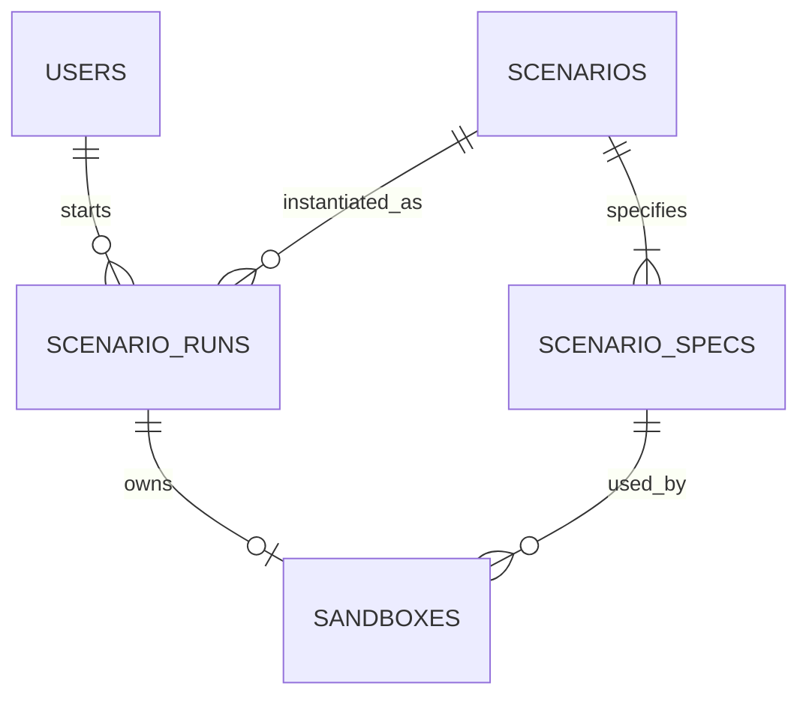

# RESCENE ERD

## Current Draft

## Tables

### users

| Column | Type | Nullable | Description |
| --- | --- | --- | --- |
| id | bigint | no | User primary key. MVP seed data uses `1` for the test user. |
| display_name | varchar(50) | no | System-style learner display name. MVP seed value: `test_user`. |
| created_at | timestamptz | no | Row creation time. |
| updated_at | timestamptz | no | Last row update time. |

### scenarios

| Column | Type | Nullable | Description |
| --- | --- | --- | --- |
| id | bigint | no | Scenario primary key. |
| title | varchar(100) | no | Scenario title shown on list and detail pages. |
| summary | varchar(255) | no | Short scenario summary shown on list cards. |
| description | text | no | Full scenario description shown on the detail page. |
| category | varchar(50) | no | Scenario category. Allowed values: `SPRING_BOOT_RUNTIME`, `DATABASE`, `QUEUE`. |
| difficulty | varchar(50) | no | Scenario difficulty. Allowed values: `BEGINNER`, `INTERMEDIATE`, `ADVANCED`. |
| created_at | timestamptz | no | Row creation time. |
| updated_at | timestamptz | no | Last row update time. |

### scenario_specs

| Column | Type | Nullable | Description |
| --- | --- | --- | --- |
| id | bigint | no | ScenarioSpec primary key. |
| scenario_id | bigint | no | Scenario that owns this execution spec. Foreign key to `scenarios.id`. |
| image_ref | varchar(255) | no | Container image reference used to provision the Sandbox. |
| created_at | timestamptz | no | Row creation time. |
| updated_at | timestamptz | no | Last row update time. |

### scenario_runs

| Column | Type | Nullable | Description |
| --- | --- | --- | --- |
| id | bigint | no | ScenarioRun primary key. |
| user_id | bigint | no | User who started this run. Foreign key to `users.id`. |
| scenario_id | bigint | no | Scenario being attempted. Foreign key to `scenarios.id`. |
| status | varchar(50) | no | Run status. Allowed values: `ACTIVE`, `COMPLETED`, `BROKEN`, `ABANDONED`, `EXPIRED`. |
| started_at | timestamptz | no | Time when the learner started this run. |
| completed_at | timestamptz | yes | Time when the learner completed this run. |
| last_accessed_at | timestamptz | no | Last time the learner opened or interacted with this run. |
| created_at | timestamptz | no | Row creation time. |
| updated_at | timestamptz | no | Last row update time. |

### sandboxes

| Column | Type | Nullable | Description |
| --- | --- | --- | --- |
| id | bigint | no | Sandbox primary key. |
| scenario_run_id | bigint | no | ScenarioRun that owns this Sandbox. Foreign key to `scenario_runs.id`. |
| scenario_spec_id | bigint | no | ScenarioSpec used to provision this Sandbox. Foreign key to `scenario_specs.id`. |
| status | varchar(50) | no | Sandbox status. Allowed values: `PROVISIONING`, `RUNNING`, `STOPPED`, `BROKEN`, `DESTROYED`. |
| workspace_path | varchar(500) | no | Filesystem path for the mounted workspace directory. |
| created_at | timestamptz | no | Row creation time. |
| updated_at | timestamptz | no | Last row update time. |

## Indexes And Constraints

- `scenario_runs.user_id` references `users.id`.
- `scenario_runs.scenario_id` references `scenarios.id`.
- `scenario_specs.scenario_id` references `scenarios.id`.
- `sandboxes.scenario_run_id` references `scenario_runs.id`.
- `sandboxes.scenario_spec_id` references `scenario_specs.id`.
- `sandboxes.scenario_run_id` must be unique because one ScenarioRun can have at most one Sandbox.
- Only one active ScenarioRun is allowed per `(user_id, scenario_id)`.

